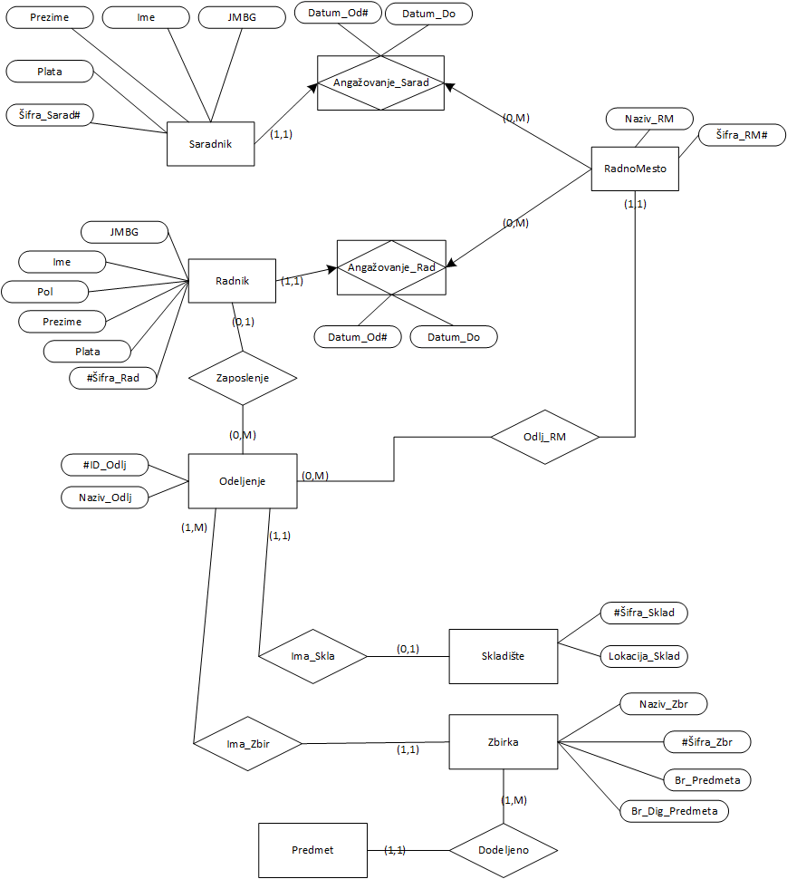
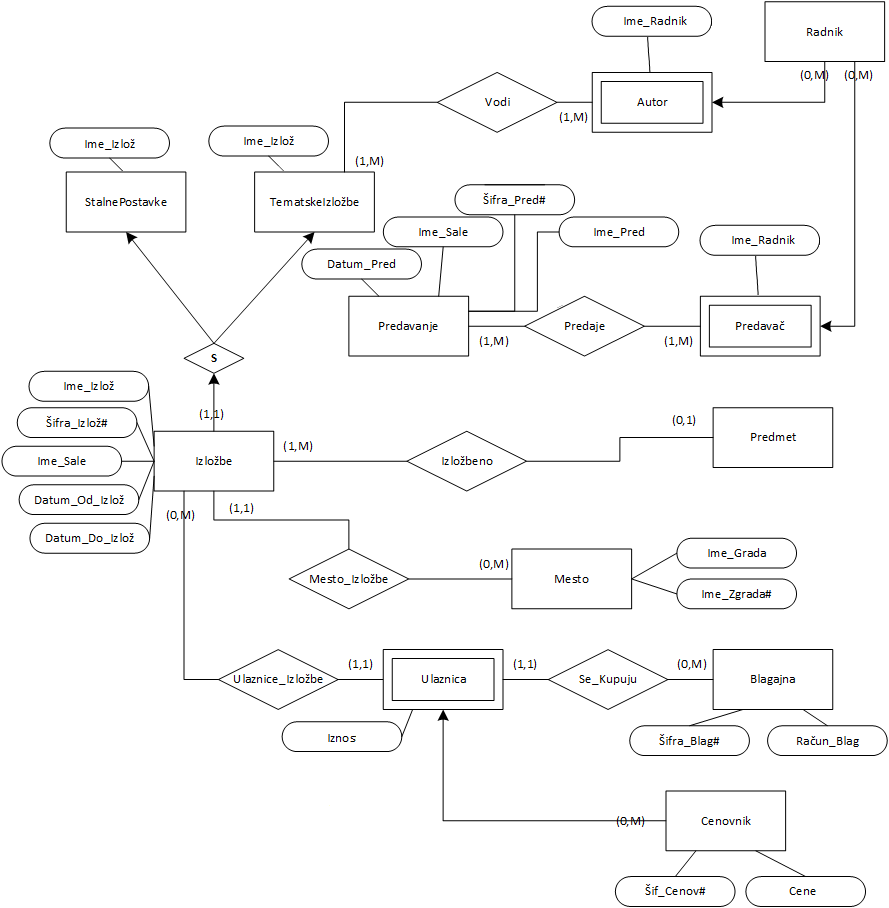
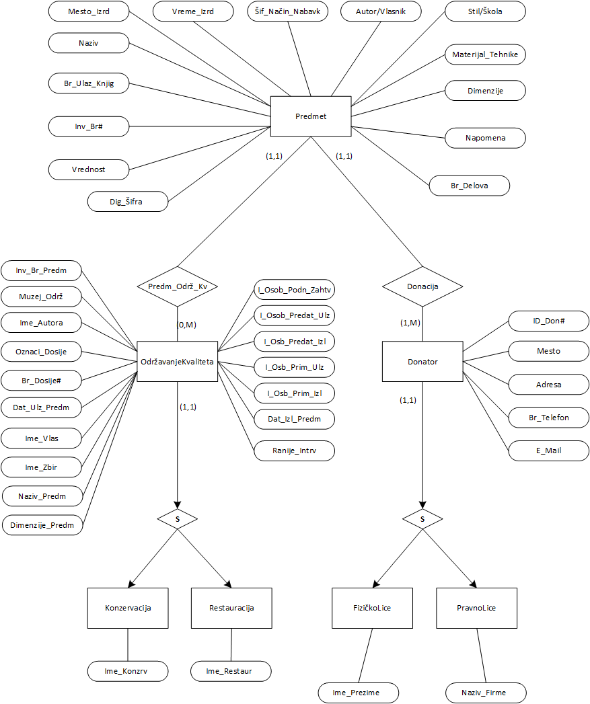
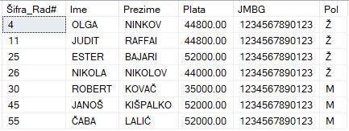
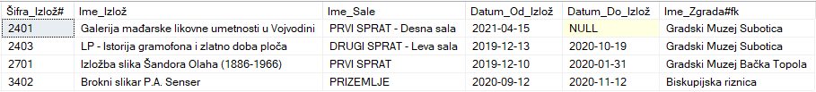
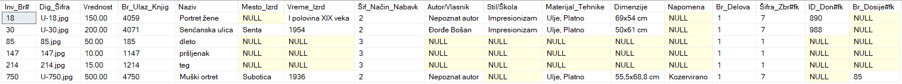

# Database System for the City Museum of Subotica  

## 📌 Project Overview  
This project was developed as part of a university database course. The goal was to design and implement a relational database system to support the operations of the **City Museum of Subotica**.  

The project covers the full cycle of database development:  
- Business domain analysis  
- Conceptual modeling (PMOV)  
- Translation to a relational model  
- SQL Server implementation (DDL and DML)  
- Data population with sample records  
- Creation of views, stored procedures, and functions for business transactions  

---

## 🏛 Business Domain  
The system models three main subsystems of the museum:  

1. **Employees and Departments** – management of employees, collaborators, departments, and work positions.  
2. **Exhibitions** – handling permanent and thematic exhibitions, authors, locations, tickets, and pricing.  
3. **Artifacts** – storage and cataloging of museum items, including acquisition, restoration, conservation, and donor information.  

---

## 🗂 Data Models  

### 👥 Employees and Departments  
Covers workers, collaborators, departments, and job roles.  
- Each worker has personal data, employment history, and department assignment.  
- Departments (e.g., Archaeology, Ethnology, Library) manage collections and storage.  

   

---

### 🖼 Exhibitions  
Handles museum exhibitions, tickets, pricing, and lectures.  
- Exhibitions may be permanent or thematic.  
- Records include halls, start/end dates, authors, and locations.  
- Tickets are linked to a price list and sales counters.  

Conceptual model (PMOV):  

  

---

### 🏺 Artifacts  
Covers museum objects, donors, and quality maintenance.  
- Each artifact has acquisition details, material, dimensions, and digital record.  
- Donors can be individuals or institutions.  
- Supports restoration and conservation processes.  

   

---

## ⚙️ Implementation  

### Database Schema  
The relational model was implemented in **SQL Server**. Example table:  

```sql
CREATE TABLE [Radnik] (
  [Šifra_Rad#] INT PRIMARY KEY,
  [Ime] NVARCHAR(30) NOT NULL,
  [Prezime] NVARCHAR(30) NOT NULL,
  [Plata] MONEY NOT NULL,
  [JMBG] NUMERIC(18,0) NOT NULL,
  [Pol] NVARCHAR(1) NOT NULL
);
```

### Business Logic
- **Views** – for example, employee overview with department and job position.
- **Stored procedures** – e.g., managing employee contracts.
- **Functions** – used to implement and demonstrate business transactions.

---

## 📊 Sample Outputs

The database was populated with sample data and verified with tabular outputs for:

- Employees and departments
- Exhibitions and tickets
- Artifacts and donors

   
   
   

---

## 🚀 Technologies Used

- **SQL Server** (DDL, DML, stored procedures, functions)
- **Relational database modeling**
- **ER and PMOV diagrams**

---

## 📖 Project Report

For full details, see the [Project PDF](./PodrskaRadaGradskogMuzejaSubotica_ViktorVarkulja_28120.pdf).

---

## 👤 Author

**Viktor Varkulja**
Master student in IT | Database design and software engineering enthusiast
